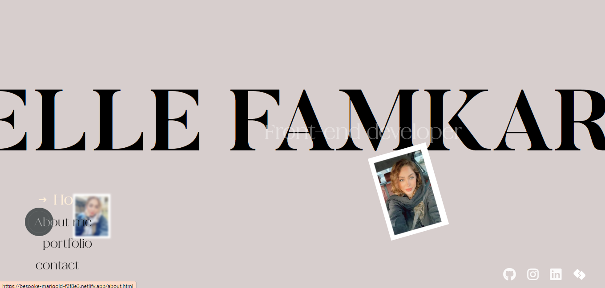
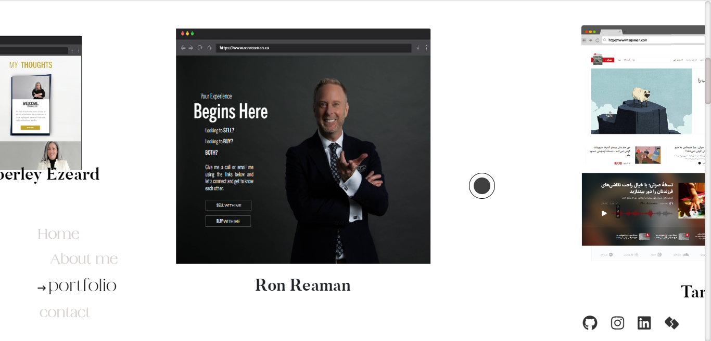
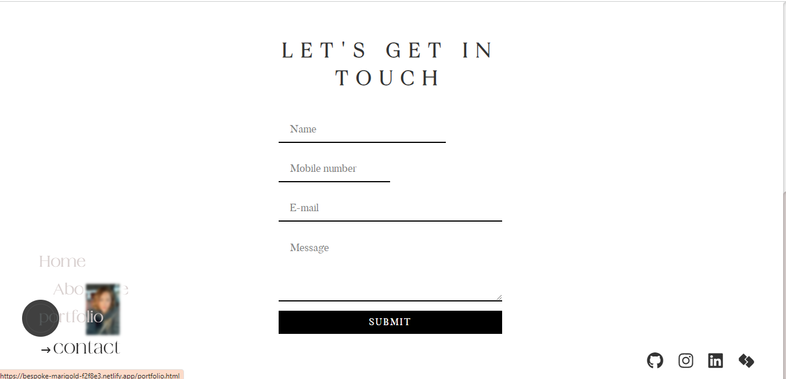

# Welcome to my potfolio 👋

## Table of contents

- [Overview](#overview)
  - [The challenge](#the-challenge)
  - [Screenshot](#screenshot)
  - [Links](#links)
- [My process](#my-process)
  - [Built with](#built-with)
  - [What I learned](#what-i-learned)
  - [Continued development](#continued-development)
  - [Useful resources](#useful-resources)
- [Author](#author)
- [Acknowledgments](#acknowledgments)

## Overview

Thanks for checking out my portfolio project. This is a temporary portfolio and i am going to build a new one with react in a couple of month, So let's enjoy it for now! 🙋‍♀️ 

Remember that "Every day is a learning day" and try to learn from everyone! 

 ### Screenshot 





### Links

- Live Site URL: [Portfolio](https://ellefamkar.com/)

## My process

### Where to find resources

The first think to do is to look for your perfect design! So let's checkout [dribble](https://dribbble.com/) our favourite design to begin!

### Built with

- Vanilla JavaScript(ES6+)
- SASS
- GSAP
- Bootstrap
- Semantic HTML5 markup
- CSS
- Flexbox / CSS Grid
- desktop-first workflow
- WEB3 form

### Clean Code using

- BEM / Conventional commits

You can use any tools you like to help you complete the project. So if you got something you'd like to practice, feel free to give it a try. However, i wrote this design with simple html5 and css and js and made it responsive for all the devices, since my users should be able to: View the optimal layout and hover or active states depending on their device's screen size

### What I learned

This projects helped me being more familiar with the details of js and how to work with GSAP, and use my scss knowledge as well to create a responsive project with small details on colors,sizes and so on. I used amazing plugins from GSAP and used horiztontal scrolling.
To see parts of my codes and see how you can add code snippets, see below:


```html

     <main class="o-main-container container-fluid m-0 p-0">
          <div class="c-main-title-box position-relative d-flex flex-column align-items-center">
              <h1 class="c-main-title" id="c-main-title">
                  <span class="c-main-title--one">MY</span>
                  <span class="c-main-title--two">PORTFOLIO</span>
              </h1>
              <p class="c-main-job-title mb-0 text-white c-typewriter js-typewriter">My art as a developer!</p>
              <div class="c-scroll c-scroll--heading w-100 d-none d-md-flex align-items-center justify-content-center position-relative">
                <strong class="mr-2 d-inline-block c-scroll-text text-white">Keep scrolling</strong>
                <div class="c-scroll-wrapper">
                  <div class="c-scroller"></div>
                </div>
              </div>
              
          </div>
    </main>

```


```scss

    .c-contact-form__title {
    text-align: center;
    font-family: $font-iskry, sans-serif;
    text-transform: uppercase;
    letter-spacing: 13px;
    font-size: 36px;
    line-height: 48px;
    padding-bottom: 12px;
 }
 
.c-contact-form {
    // z-index: 100;

    &__field {
       position: relative;
       margin: 32px 0;
    }
    &__input {
       display: block;
       width: 100%;
       height: 36px;
       border-width: 0 0 2px 0;
       border-color: #000;
       font-family: $font-bulter, sans-serif;
       font-size: 16px;
       line-height: 26px;
       font-weight: 400;
       
       &:focus {
          outline: none;
       }
       
       &:focus,
       &.not-empty {
          + .c-contact-form__label {
             transform: translateY(-24px);
             left:0;
          }
       }
    }
    &__textarea{
        display: block;
        width: 100%;
        border-width: 0 0 2px 0;
        border-color: #000;
        font-family: $font-bulter, sans-serif;
        font-size: 16px;
        line-height: 26px;
        font-weight: 400;

        &:focus {
            outline: none;
         }
         
         &:focus,
         &.not-empty {
            + .c-contact-form__label {
               transform: translateY(-24px);
               left:0;
            }
         }
    }
```

``` js
  
if(body.classList.contains("o-scrollable-body")){

  function toggleBg(entries, observer) {
    entries.forEach(entry => {
      if (entry.intersectionRatio > 0) {
        body.classList.toggle('is-light');
      } else {
        entry.target.classList.remove('in-viewport');
      }
    });
  }
  let observer = new IntersectionObserver(toggleBg, {threshold: .2});
  observer.observe(target);
}

gsap.to(sections, {
  xPercent: -100 * (sections.length - 1),
  ease: "none",
  scrollTrigger: {
    trigger: ".container-slider",
    pin: true,
    scrub: 1,
    snap: 1 / (sections.length - 1),
    end: "+=3500",
  }
});

```


### Useful resources

In order to do this project in a correct way you need to have a good knowledge of html and css and js, so let's master at them with these fruitful resources.

- [w3schools](https://www.w3schools.com/) - This helps you a lot with both your css and html which is easy to read and has numerous examples.
- [MDN](https://developer.mozilla.org/en-US/) - Remember that no matter how many tutorial videos you have watched, you always need to learn details and features from codes documentations
- [codeacademy](https://www.codecademy.com/)
- [udemy](https://www.udemy.com/) - Here you can find a number of tutorials in different languages
- [coursera](https://www.coursera.org/)

## Author

- Website - [Elle Famkar](https://bespoke-marigold-f2f8e3.netlify.app/)
- Twitter - [@Ellefamkar](https://www.twitter.com/ellefamkar)

Feel free to ask any questions come to your mind  and send me message via my current temporary website in the link above!

## Acknowledgments

I am thankful to each and every person in this area who teaches me a single piece of code! I learn every single day from amazing people! so I need to thank you all ❤

**Have fun using this project!** 🚀
